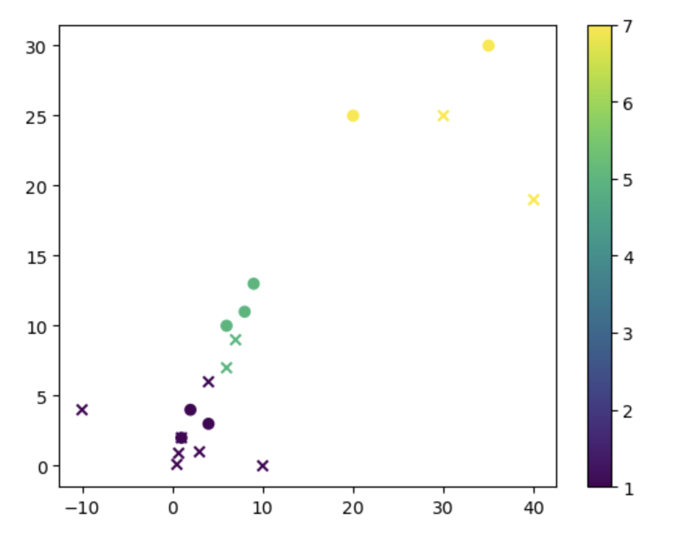

# KNN_Recreation

## 1D: 

This is my own recreation of K Nearest Neighbors using only Python. It can only read 1D datasets. It was fun and challenging.

## 2D:

I modified my recreation of K Nearest Neighbors, so now it can read 2D datasets. 

### the processes of creating the recreation to support 2D data:

I coded a function that could loop through the dataset and compare it to one new test data point. 

Then I coded a loop outside the function that goes through all of the test data points and runs the function. This allows me to put in as many test data points as I want. 

### Graphing a Dataset:

As a final experiment, I created a data set for grocery bag height and weight. This graph shows the different sizes of the 3 different types of grocery bags.

## Conclusion

This process was very rewarding, as I now have a substantial algorithm that I created myself. I can feed it any data that I want, as long as it is 2D. This was overall very successful.

